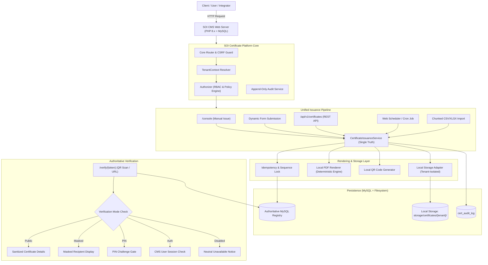

# SOI Certificate Management Platform - Architectural Flow Design & Team Delegation Plan

## 1. System Architecture Overview

The **SOI Certificate Management Platform** is engineered as a modular, multi-tenant, local-first product plugin designed for the SOI CMS ecosystem (consistent with MyApps). It operates with zero mandatory external infrastructure in v1 (no Redis, S3, Cloudflare, or external queue dependencies).

---

## 2. Request & Execution Workflow

### A. Certificate Issuance Sequence
1. **Entrypoint**: Caller initiates an issue command via `/console`, `/api/v1/certificates`, or dynamic form.
2. **Context & Auth**: `TenantContext` verifies active tenant membership; `Authorizer` checks `certificates.issue` permission or API client scope.
3. **Template Snapshot**: The exact published `TemplateVersion` is retrieved. Variable schemas and types are strictly validated.
4. **Concurrency & Numbering**: A dedicated database sequence lock allocates the next human-readable certificate number (`SOI-YYYY-XXXXX`). A cryptographically random 128-bit verification token is generated.
5. **Deterministic PDF & QR Render**: 
   - `QrCodeGenerator` creates a local QR matrix pointing to `/verify/{token}`.
   - `LocalCertificateRenderer` stitches layout elements, background, fonts, variables, and QR into a valid PDF document.
6. **Artifact Storage & Integrity**:
   - PDF is stored at `storage/certificates/{tenant_slug}/{yyyy}/{mm}/{id}.pdf`.
   - File SHA-256 checksum is calculated and written to `cert_certificates`.
7. **Commit & Webhook**:
   - Status transitions to `ISSUED`.
   - Append-only audit record is committed.
   - Outbound HMAC-SHA256 webhooks are queued/dispatched if configured.

### B. Public Verification Sequence
1. Verifier scans the QR code or navigates to `/verify/{token}`.
2. The system loads the authoritative record by `verification_token_hash` / `token`.
3. Tenant verification policy is evaluated (`public`, `masked`, `pin`, `authenticated`, `disabled`).
4. Sanitized certificate details are rendered with `noindex, nofollow` headers. Raw server filesystem paths, SQL data, and internal IDs are strictly hidden.

---

## 3. Developer Team Task Delegation Matrix

To build and deliver the 12-Prompt Roadmap cleanly, the project is structured across 6 dedicated developer tracks:

| Track / Role | Assigned Modules | Prompts Owned | Core Deliverables |
| :--- | :--- | :--- | :--- |
| **Dev 1: Core Platform & Security Lead** | `Core/`, `Tenancy/`, `Authorization/`, `Audit/` | Prompts 1, 2, 12 | • Autoloading, Module Registry, Database wrapper • Migration runner & schema tracking • `TenantContext`, multi-tenant query boundaries • RBAC Authorizer with platform admin bypass • Append-only audit log system • CSRF protection & safe error envelopes |
| **Dev 2: Template Domain & Designer Engineer** | `Templates/`, `Designer/`, Frontend Canvas | Prompts 3, 4 | • Template CRUD & immutable versioning logic • Asset library (logos, seals, signatures, backgrounds) • 3-pane visual canvas designer (A4/Letter, coordinates, z-index) • Structured JSON layout schema validator • Live designer preview with sample variables |
| **Dev 3: Rendering & Storage Engineer** | `Rendering/`, `Storage/` | Prompt 5 | • `CertificateRendererInterface` & `LocalCertificateRenderer` • Self-contained pure PHP PDF generation engine • Local pure PHP QR code matrix generator (no external APIs) • `LocalStorageAdapter` with directory traversal protection • SHA-256 file hashing & storage health diagnostics |
| **Dev 4: Issuance & Verification Engineer** | `Issuance/`, `Verification/` | Prompts 6, 7 | • Unified `CertificateIssuanceService` • Transactional certificate numbering sequence generator • Cryptographic verification token generation • Lifecycle state machine (`ISSUED`, `REVOKED`, `EXPIRED`, `REPLACED`) • `/verify/{token}` verification engine with 5 security modes |
| **Dev 5: Forms & Scheduling Engineer** | `Forms/`, `Scheduling/` | Prompt 8 | • Dynamic form builder mapped to template schemas • Public/internal form submission & approval queue • Database-backed job table (`cert_jobs`) with atomic leases • Web scheduler runner (cron endpoint + opportunistic web runner) • Expiration evaluator & automated issuance triggers |
| **Dev 6: Integration, API & Bulk Import Engineer** | `Api/`, `Webhooks/`, Bulk Imports | Prompts 9, 10 | • REST API (`/api/v1/`) with Bearer token authentication • Scoped API clients with one-way hashed secrets • `Idempotency-Key` replay prevention & fingerprinting • HMAC-SHA256 signed outbound webhooks with retry log • Browser-orchestrated chunked CSV/XLSX bulk issuance |
| **Dev 7: UI/UX, Portals & Documentation Lead** | `Http/`, `views/`, `assets/`, `Docs/` | Prompts 11, 12 | • Enterprise portal shells: `/super-admin`, `/manage`, `/console` • Responsive styling, accessibility (WCAG focus/contrast) • Interactive `/docs` portal (API reference, curl examples) • Update Center packaging script (`manifest.json`, ZIP builder) • E2E smoke tests & `docs/development-status.md` maintenance |
